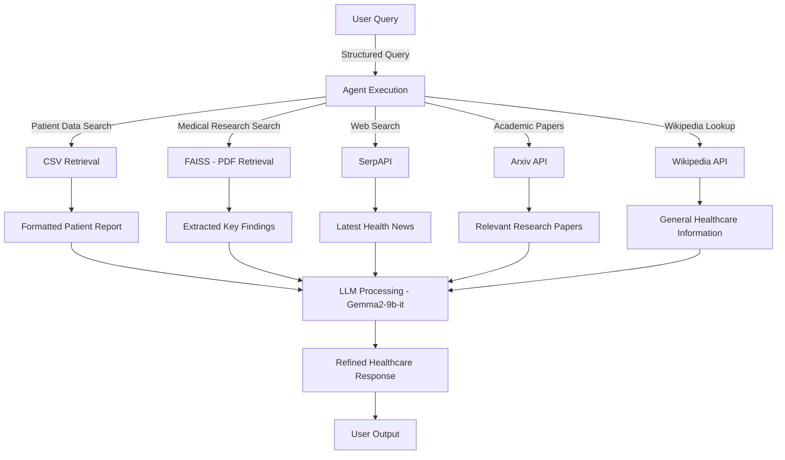

# Healthcare Agentic AI

## Overview
The **Healthcare Agentic AI** system is designed to provide intelligent and real-time healthcare assistance by integrating multiple data sources, including:
- **Patient records (CSV)**
- **Medical research papers (FAISS - PDF)**
- **Real-time health updates (SerpAPI & Wikipedia)**
- **Academic research (Arxiv API)**

It uses **Retrieval-Augmented Generation (RAG)** to retrieve relevant information and process responses using an **LLM model (Gemma2-9b-it)**.

## Project Workflow



## Key Components

### 1. **Data Sources**
- **CSV (Patient Records):** Retrieves structured patient medical data.
- **FAISS (Medical Research PDFs):** Uses FAISS to search relevant research papers.
- **SerpAPI:** Fetches real-time medical updates from the web.
- **Arxiv API:** Queries academic research papers related to healthcare.
- **Wikipedia API:** Provides general health information from Wikipedia.

### 2. **AI Agent**
- Uses **LangChain** to orchestrate queries across different tools.
- Executes **zero-shot reasoning** with structured response formatting.

### 3. **LLM Processing (Gemma2-9b-it)**
- Takes raw data from retrieval tools.
- Formats it into a **clear and structured response**.

### 4. **Response Generation**
- **User-friendly medical insights**
- **Bullet-point summaries for readability**
- **Citations from trusted sources**

## Installation
```bash
# Clone the repository
git clone https://github.com/jagdish0307/AgenticRag.git
cd AgenticRag

# Create and activate a virtual environment
python -m venv venv
source venv/bin/activate  # On Windows use 'venv\Scripts\activate'

# Install dependencies
pip install -r requirements.txt
```

## Running the Agent
```bash
python agent.py
```

## Testing the Tools
```bash
python tests/test_csv.py
python tests/test_pdf.py
python tests/test_serpapi.py
python tests/test_agent.py
```

## Configuration (config.py)
Ensure your **API keys, file paths, and model configurations** are set up in `config.py` to keep them secure and reusable.

```python
GROQ_API_KEY = "your_groq_api_key"
SERPAPI_KEY = "your_serpapi_key"
ARXIV_API_KEY = "your_arxiv_api_key"
WIKI_API_KEY = "your_wikipedia_api_key"

EMBEDDING_MODEL_NAME = "sentence-transformers/all-MiniLM-L6-v2"
LLM_MODEL_NAME = "gemma2-9b-it"

CSV_FILE_PATH = "data/healthcare_dataset.csv"
DEFAULT_PDF_PATH = "data/medical_papers.pdf"
```

## Future Improvements
- **Integrate SQL-based patient record retrieval**
- **Expand multi-modal capabilities (X-ray, MRI image analysis)**
- **Enhance response summarization with more advanced AI models**


---


